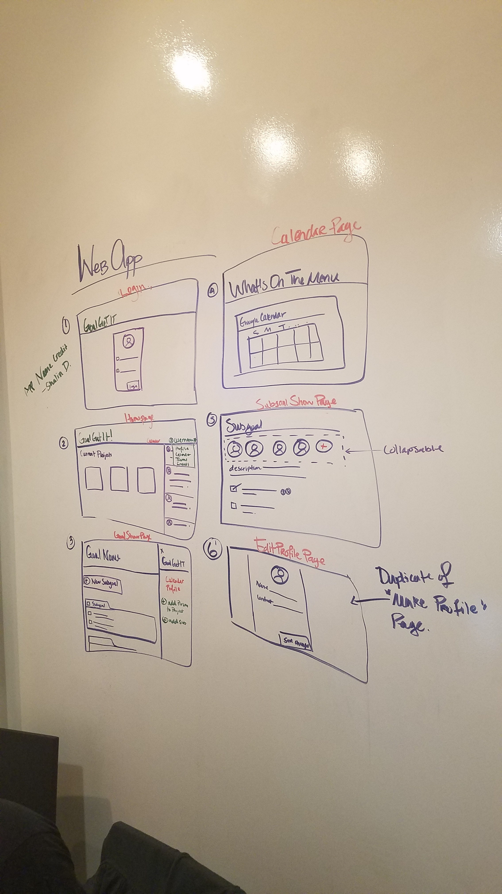
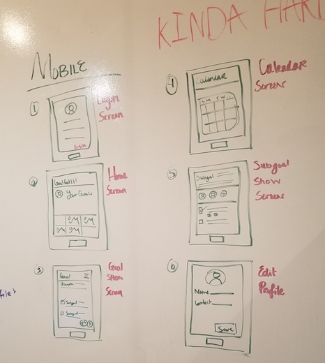
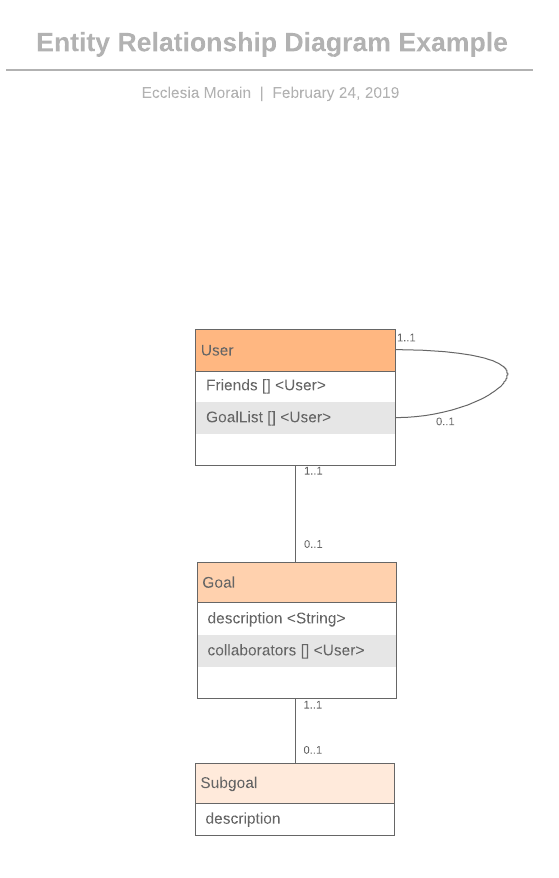

# SquadGoals
Assistance app to maintain accountability and productivity when making collaborative and personal goals. *Will* Integrate with Google Calendar to provide push notifications to mobile devices.

### Installing / Accessing
 - Web app accessible [here](https://squad-goals-app.herokuapp.com)! 

### Technologies Used
- [Vectr](http://vectr.com) - for wireframing and pre-planning.
- [Trello](https://trello.com/b/4UXOAV53/squadgoalsapp) For Project Management
- [Node.js](https://nodejs.org/en/) - Javascript interpreting and package management
- [Express.js](https://expressjs.com/) - Route handling; Middleman btwn client and server.
- [Mongoose and MongoDB](https://mongoosejs.com/) - Database management
- [React.js](https://reactjs.org/) - Client/ Front-end management.
- [Heroku](http://heroku.com) for deployment
- [Bulma](https://bulma.io/) for styling 

### Authors

* **Ecclesia Morain** 

### Wireframes

### Entity Relationship Diagram 

### Acknowledgments
* [William](https://github.com/wsnjie)
* [Justin Bradley](https://github.com/JustinBradley9)
* [Andrew McIntosh](https://github.com/andrewbmcintosh)
* The following Unsplash photgraphers for their photos: 

### Similar Products/ References/ Inspiration: 
- Trello: https://trello.com/
- Asana: https://asana.com/
